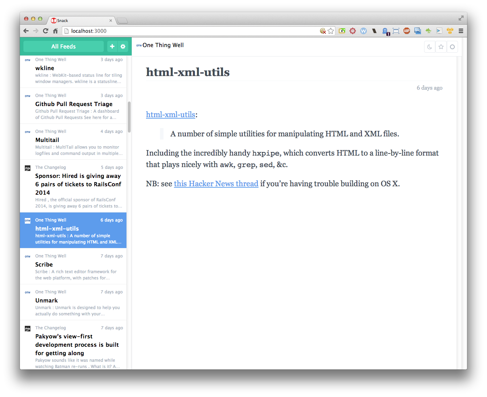

# Snack

The minimalist feed reader

## Features

  * Lightweight and speedy, built as a single page app (angularjs-rails)
  * Minimalist reading experience and visuals (http://bootflat.github.io/)
  * Mobile friendly (swipe left/right for previous/next entry) (hammerjs-rails)
  * Mail.app like layout on tablet/desktop (flexbox)
  * Keyboard shortcuts (mousetrap-rails)
  * Bayes classification of entries (?)
  * Server-side readability processing (?)
  * Multi-threaded (sucker_punch)
  * Self-hosted (Heroku/Dockerfile)
